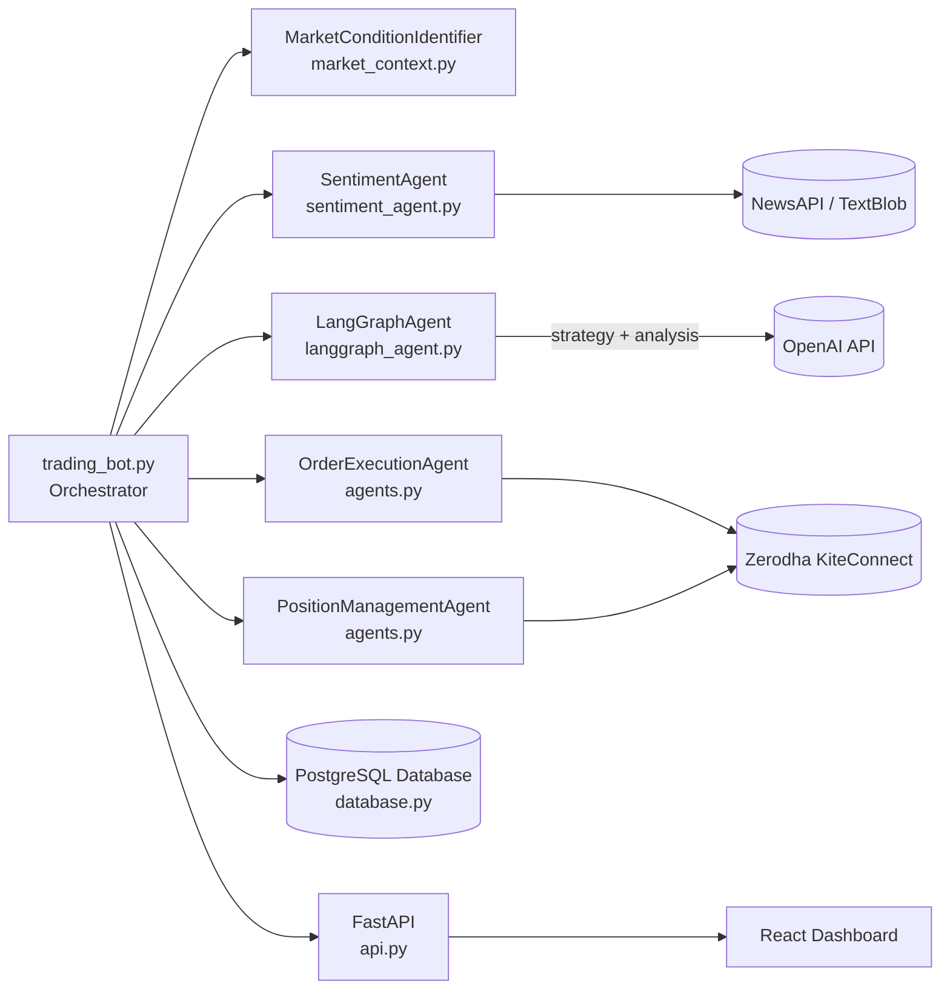

# Engine Architecture

This diagram illustrates the high-level components of the trading engine and how they interact.

The orchestrator coordinates agents, which communicate with external services like Zerodha, OpenAI, and NewsAPI. All trades, holdings, and sentiment statistics are persisted in PostgreSQL and surfaced through a FastAPI backend to a React dashboard.

